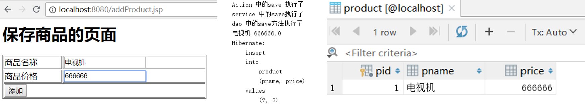

### SSH框架的整合

1. 简介

   * 三大框架之间的关系

     

   * <span id="jump">框架回顾和介绍参考</span>

     https://www.cnblogs.com/tuhooo/p/6491906.html

     https://www.cnblogs.com/laibin/p/5847111.html

2. 环境搭建

   * 导入相关jar包

     参考：[框架回顾和介绍参考](#jump)

   * 配置web.xml

     ```xml
     <web-app>

     <!--Spring 框架的核心监听器-->
     <listener>
         <listener-class>org.springframework.web.context.ContextLoaderListener</listener-class>
     </listener>

     <context-param>
         <param-name>contextConfigLocation</param-name>
         <param-value>classpath:applicationContext.xml</param-value>
     </context-param>

     <!--Struts2框架的核心过滤器的配置-->
     <filter>
         <filter-name>struts</filter-name>
         <filter-class>org.apache.struts2.dispatcher.filter.StrutsPrepareAndExecuteFilter</filter-class>
     </filter>
     <filter-mapping>
         <filter-name>struts</filter-name>
         <url-pattern>/*</url-pattern>
     </filter-mapping>

     </web-app>
     ```

3. Struts2整合Spring

   ------

   项目结构

   编写各层代码

   配置（两种整合方式）

   * [Action类由Struts2自身去创建](#jump1)
   * [Action类交给Spring框架创建](#jump2)

   ------

   * 项目结构

     

   * 编写 实体类 与 addProduct.jsp

     * addProduct.jsp

       ```jsp
       <%@ page contentType="text/html;charset=UTF-8" language="java" %>
       <%@ taglib uri="/struts-tags" prefix="s"%>
       <html>
       <head>
           <title>addProduct</title>
       </head>
       <body>
       <h1>保存商品的页面</h1>
       <s:form action="product_save" method="POST" namespace="/" theme="simple">
           <table border="1" width="400">
               <tr>
                   <td>商品名称</td>
                   <td><s:textfield name="pname"/> </td>
               </tr>
               <tr>
                   <td>商品价格</td>
                   <td><s:textfield name="price"/> </td>
               </tr>
               <tr>
                   <td colspan="2"><input type="submit" value="添加"/></td>
               </tr>
           </table>
       </s:form>
       </body>
       ```

     * Product.java

       ```java
       public class Product {
           private int pid;
           private String pname;
           private Double price;
       	//getter and setter
       }
       ```

       ​

   * 编写Action，Service，DAO

     * ProductAction

       ```java
       public class ProductAction extends ActionSupport implements ModelDriven<Product> {
           //模型驱动使用的类
           private Product product=new Product();
           @Override
           public Product getModel() {
               return product;
           }

           //Struts和Spring整合过程中按照名称自动注入的业务层的类
           //!!!!!!!!!!!!!这里用到了struts和spring整合的自动装配!!!!!!!!
           //如果是使用的由struts管理action 没有struts2-spring-plugin.jar就不会成功！
           private ProductService productService;
           public void setProductService(ProductService productService) {
               this.productService = productService;
           }

           //保存商品的执行的方法
           public  String save(){
               System.out.println("Action 中的save 执行了");
               productService.save(product);
               return NONE;
           }

       }
       ```

     * ProductService

       ```java
       public class ProductService {

           //业务层注入DAO的类 这里使用了Spring的配置文件 详见applicationContext.xml
           private ProductDao productDao;

           public void setProductDao(ProductDao productDao) {
               this.productDao = productDao;
           }


           //业务层保存商品的方法
           public void save(Product product) {
               System.out.println("service 中的save执行了");
               productDao.save(product);

           }
       }
       ```

       ​

     * ProductDao

       ```java
       public class ProductDao {
           //dao中保存商品的方法
           public void save(Product product) {
               System.out.println("dao 中的save方法执行了");
           }
       }
       ```

   * 配置Action，Service，DAO的类

     * 通用配置

       applicationContext.xml中配置业务层与DAO层

       ```xml
       <!--配置业务层的类-->
       <bean id="productService" class="learn.ssh.service.ProductService">
           <property name="productDao" ref="productDao"/>
       </bean>

       <!--配置DAO的类-->
       <bean id="productDao" class="learn.ssh.dao.ProductDao">

       </bean>
       ```

     *  <span id="jump1">Action类由Struts2自身去创建</span>

       applicationContext.xml中**不需要**添加关于**productAction**的Bean

       需要**struts2-spring-plugin.jar**

       此时struts.xml的配置

       ```xml
       <struts>
           <package name="ssh" extends="struts-default" namespace="/">
              <!--当action由struts管理时，此处要写全路径，且spring的配置中不需要写其他内容-->
              <action name="product_*" class="learn.ssh.action.ProductAction" method="{1}">
           </package>
       </struts>
       ```

     * <span id="jump2">Action类交给Spring框架创建</span>

       applicationContext.xml

       ```xml
       <!--配置action类-->
       <!--struts是多例的 而spring默认是单例的 所以一定要记得该prototype-->
       <bean id="productAction" class="learn.ssh.action.ProductAction" scope="prototype">
           <!--手动注入service-->
           <property name="productService" ref="productService"/>
       </bean>

       <!--配置业务层的类-->
       ...
       <!--配置DAO的类-->
       ...
       ```

       此时struts.xml的配置

       ```xml
       <struts>
           <package name="ssh" extends="struts-default" namespace="/">        
               <!--当action由spring管理时，此处class只需要写 spring中配置的bean的id-->
               
               <action name="product_*" class="productAction" method="{1}">
               </action>
           </package>
       </struts>
       ```

4. Spring 整合Hibernate

   * 创建数据库

     ```sql
     CREATE DATABASE ssh;
     ```

   * 创建映射文件

     src/learn/ssh/domain/Product.hbm.xml(与Product同目录)

     ```xml
     <!DOCTYPE hibernate-mapping PUBLIC "-//Hibernate/Hibernate Mapping DTD 3.0//EN" "http://hibernate.sourceforge.net/hibernate-mapping-3.0.dtd">
     <hibernate-mapping>
         <class name="learn.ssh.domain.Product" table="product">
             <id name="pid" column="pid">
                 <generator class="native"/>
             </id>

             <property name="pname" column="pname" length="20"/>
             <property name="price" column="price" />
         </class>
     </hibernate-mapping>
     ```

   * Spring 整合Hibernate

     **原先会有hibernate的配置文件，此处全交给spring管理**

     * src目录下创建jdbc.properties

       ```properties
       jdbc.driverClass=com.mysql.cj.jdbc.Driver
       jdbc.url=jdbc:mysql://localhost:3306/ssh
       jdbc.username=root
       jdbc.password=123
       ```

     * applicationContext.xml

       引入外部配置文件

       ```xml
       <!--引入外部属性文件-->
       <context:property-placeholder location="classpath:jdbc.properties"/>
       ```

       配置连接池

       **tips:报错**

       ```java
       org.springframework.beans.factory.BeanCreationException:
       Error creating bean with name 'dataSource' defined in class path resource [bean-properties.xml]: Instantiation of bean failed; nested exception is org.springframework.beans.BeanInstantiationException: Failed to instantiate [com.mchange.v2.c3p0.ComboPooledDataSource]: No default constructor found; nested exception is java.lang.NoClassDefFoundError: com/mchange/v2/ser/Indirector
       ```

       **mchange-commons-java和c3p0都需要导入！**

       ```xml
       <!--配置连接池 c3p0包和mchange-commons-java包记得导入-->
       <bean id="dataSource" class="com.mchange.v2.c3p0.ComboPooledDataSource">
           <property name="driverClass" value="${jdbc.driverClass}"/>
           <property name="jdbcUrl" value="${jdbc.url}"/>
           <property name="user" value="${jdbc.username}"/>
           <property name="password" value="${jdbc.password}"/>
       </bean>
       ```

       配置hibernate的相关属性

       ```xml
       <!--配置Hibernate的相关属性-->
       <bean id="sessionFactory" class="org.springframework.orm.hibernate5.LocalSessionFactoryBean">
           <!--注入连接池-->
           <property name="dataSource" ref="dataSource"/>
           <!--配置Hibernate属性-->
           <property name="hibernateProperties">
               <props>
                   <prop key="hibernate.dialect">org.hibernate.dialect.MySQL5Dialect</prop>
                   <prop key="hibernate.show_sql">true</prop>
                   <prop key="hibernate.format_sql">true</prop>
                   <!--可以更新表结构 有表会使用当前表 没有表会创建-->
                   <prop key="hibernate.hbm2ddl.auto">update</prop>
               </props>
           </property>
           <!--加载hibernate映射文件-->
           <property name="mappingResources">
               <list>
                   <value>learn/ssh/domain/Product.hbm.xml</value>
               </list>
           </property>
       </bean>
       ```

     * 此时启动会发现，hibernate自动创建了Product表

       ```sql
       Hibernate: 
           
           create table product (
              pid integer not null auto_increment,
               pname varchar(20),
               price double precision,
               primary key (pid)
           ) engine=MyISAM
       ```

   * 编写DAO代码

     * 在DAO类上继承HibernateDaoSupport

       ```java
       public class ProductDao extends HibernateDaoSupport
       ```

     * 在配置DAO的时候，在DAO中注入SessionFactory：

       applicationContext.xml

       ```xml
       <!--配置DAO的类-->
       <bean id="productDao" class="learn.ssh.dao.ProductDao">
           <property name="sessionFactory" ref="sessionFactory"/>
       </bean>
       ```

     * 在DAO中调用模板完成保存操作

       ```java
       public class ProductDao extends HibernateDaoSupport{
           //dao中保存商品的方法
           public void save(Product product) {
               System.out.println("dao 中的save方法执行了");
               System.out.println(product.getPname()+" "+product.getPrice());
               this.getHibernateTemplate().save(product);
           }
       }
       ```

   * 事务管理

     * 配置事务管理器

       applicationContext.xml

       ```xml
       <!--配置事务管理器-->
       <bean id="transactionManager" class="org.springframework.orm.hibernate5.HibernateTransactionManager">
           <property name="sessionFactory" ref="sessionFactory"/>
       </bean>
       ```

     * 开启注解事务

       ```xml
       <!--开启注解事务-->
       <tx:annotation-driven transaction-manager="transactionManager"/>
       ```

     * 业务层类上添加注解

       ```java
       import org.springframework.transaction.annotation.Transactional;
       @Transactional
       public class ProductService {...}
       ```

5. 结果展示

   